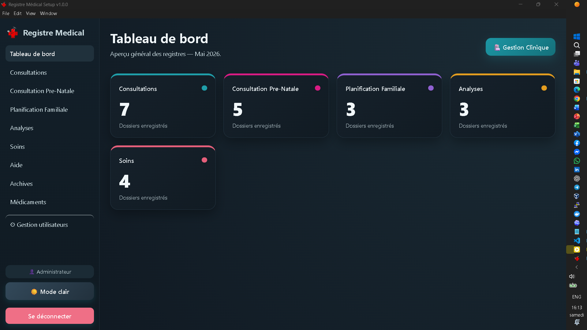
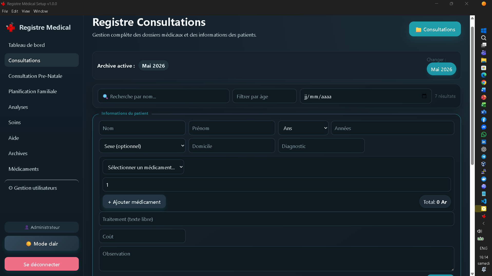
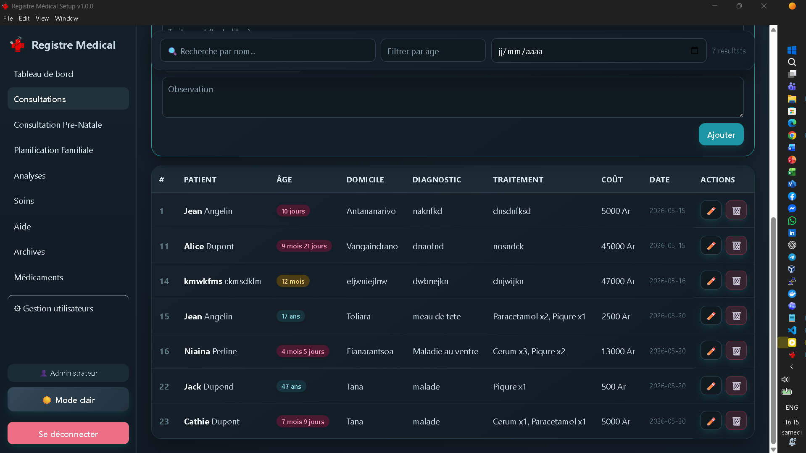
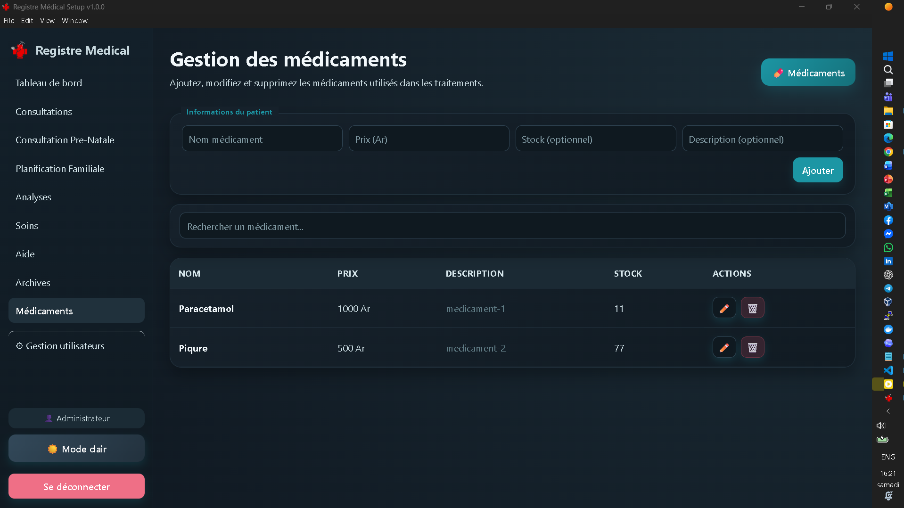
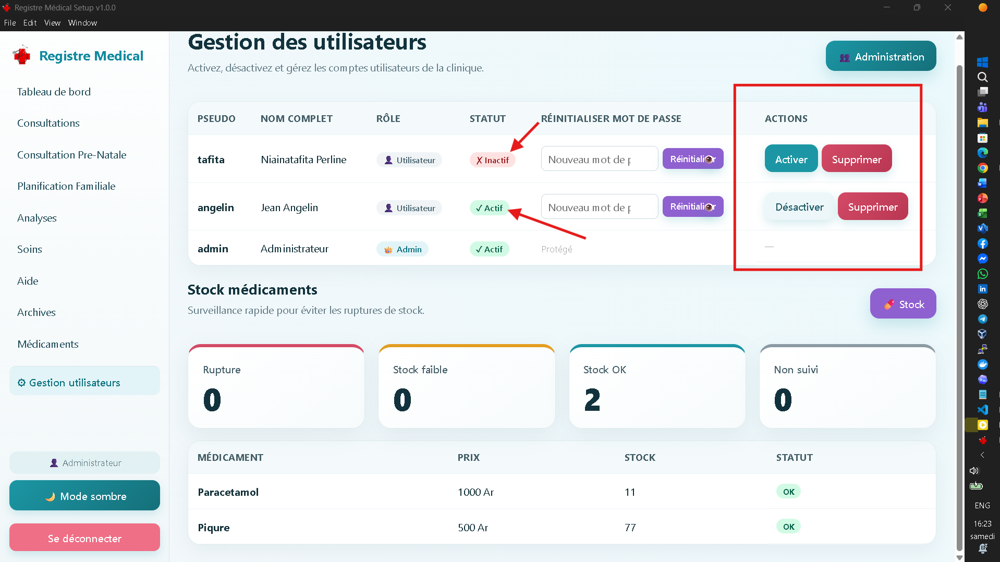
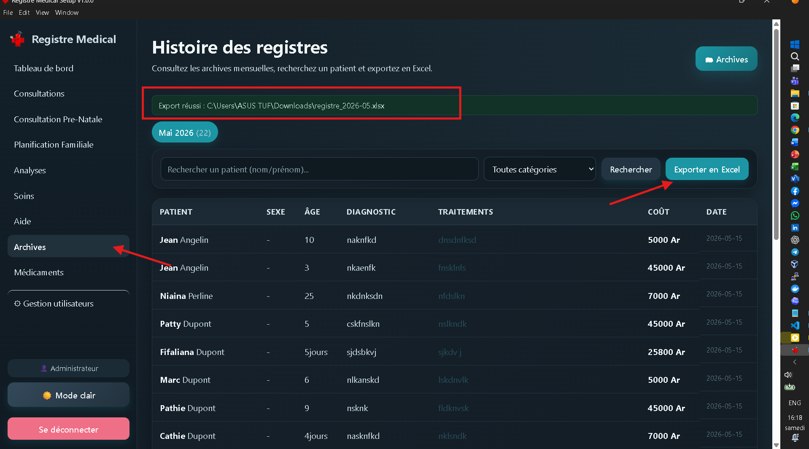
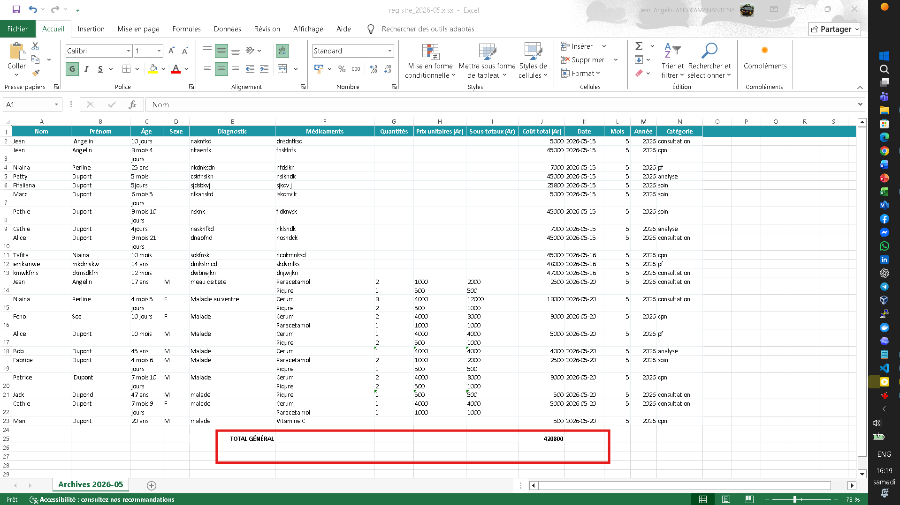
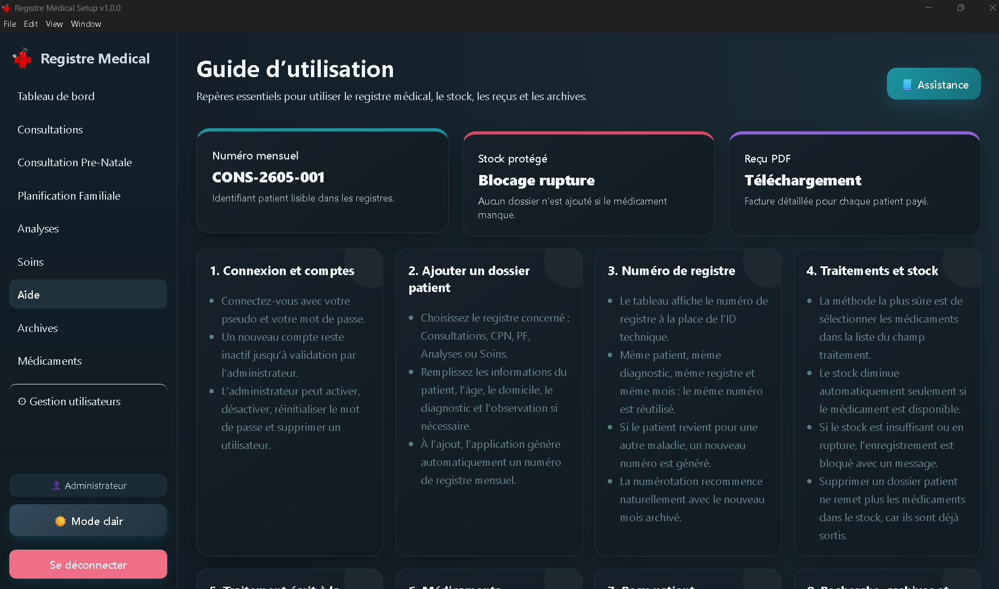

# 🏥 Registre Médical Desktop

Application desktop de gestion médicale développée avec **React**, **Electron** et **Node.js**.

---

## ✨ Fonctionnalités

- Gestion complète des consultations
- Consultation Pré-Natale
- Planification Familiale
- Analyses et Soins
- Gestion des médicaments + Stock
- Gestion des utilisateurs (Admin / Utilisateur)
- Authentification sécurisée
- Archives mensuelles avec **Export Excel**
- Tableau de bord statistique
- Recherche avancée
- Mode sombre / clair

---

## 📸 Captures d'écran

### 🔐 Page de Connexion


### 📊 Tableau de Bord


### 🩺 Registre des Consultations



### 💊 Gestion des Médicaments


### 👥 Gestion des Utilisateurs


### 📦 Archives & Export Excel



### ❓ Guide d'Utilisation


---

## 🚀 Installation

```bash
git clone https://gitlab.com/aajeanangelin/registre-medical.git
cd registre-medical
npm install
npm run dev